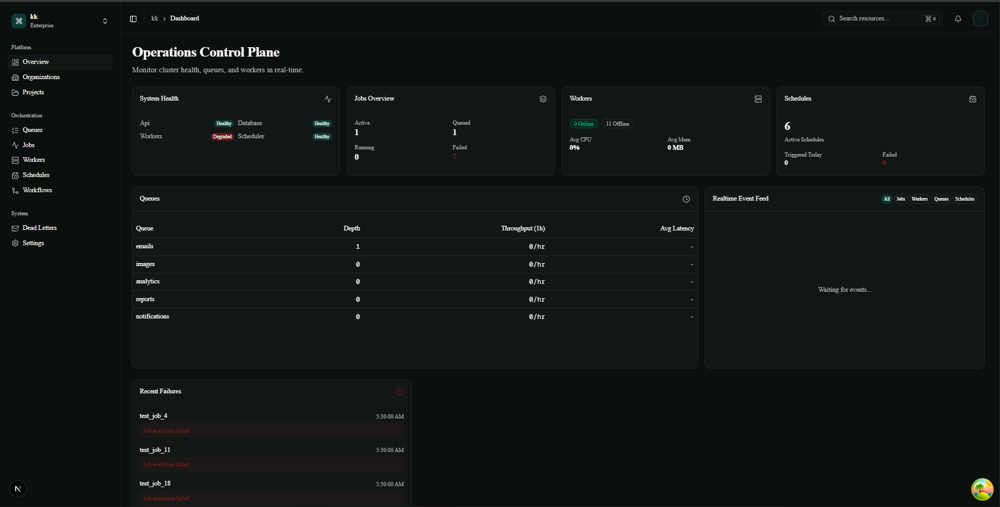
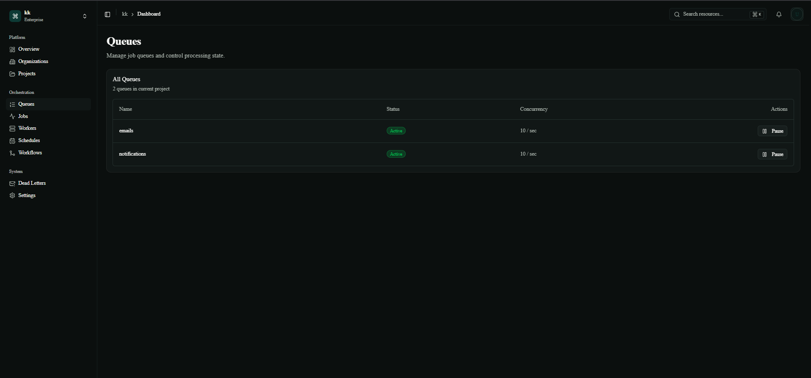
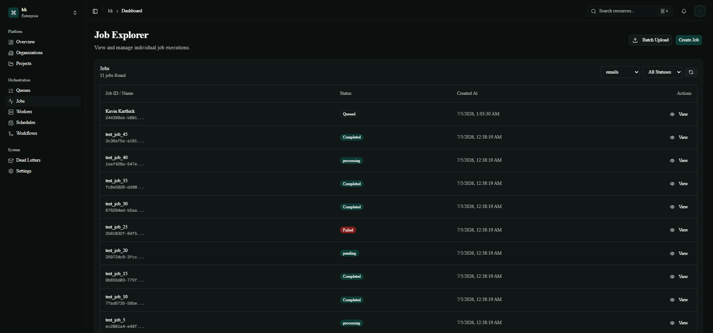

# AsyncHub - Project Report

## Overview
AsyncHub is a robust, distributed background job orchestrator and real-time control plane. It is designed to manage asynchronous tasks, recurring cron jobs, and multi-step workflows. Built with a modern tech stack, it provides a seamless developer experience with real-time UI updates, distributed worker nodes, and comprehensive dashboard analytics.

---

## Architecture & Tech Stack

### Backend (API & Worker Nodes)
- **Framework**: FastAPI (Python 3.11)
- **Database**: PostgreSQL
- **ORM**: SQLAlchemy 2.0 with `asyncpg` (Fully async database operations)
- **Real-time**: WebSockets for live status streaming
- **Workers**: Standalone Python workers executing jobs asynchronously

### Frontend (Web Dashboard)
- **Framework**: Next.js (App Router) + React 19
- **Styling**: Tailwind CSS + Shadcn UI (Base UI)
- **State & Data Fetching**: TanStack React Query for caching and optimistic UI updates
- **Animations**: GSAP (GreenSock) for beautiful scroll-triggered marketing landing pages

### Infrastructure
- Docker & Docker Compose for seamless containerized orchestration of the Database, API, Workers, and Web UI.

---

## Core Features Implemented

### 1. Multi-Tenant Workspaces & RBAC
Users can register, log in (using JWT authentication), and create multiple **Organizations**. Each organization serves as an isolated workspace where users can group their tasks into distinct **Projects**. Role-Based Access Control (RBAC) ensures only Owners and Admins can mutate workspace configurations.

### 2. Distributed Job Execution
- **Queues**: Define logical queues to separate different workloads (e.g., `emails`, `image-processing`).
- **Jobs**: Enqueue jobs with JSON payloads. Jobs support configurations like priority, maximum retries, and scheduled execution times (run_after).
- **Workers**: The distributed worker architecture polls for pending jobs, claims them using database row-level locking, processes them, and records the `JobExecution` results and errors.

### 3. Real-Time Monitoring & WebSockets
The Next.js web application establishes a live WebSocket connection to the FastAPI backend. As worker nodes pick up, process, and complete jobs, the UI instantly reflects these status changes without the user needing to refresh the page.

### 4. Comprehensive Analytics Dashboard
The dashboard provides a real-time, bird's-eye view of the system's health:
- **System Health & Overview**: Active workers, total jobs, success rates.
- **Retry Heatmap**: Visualizes which queues are experiencing the most retries.
- **Recent Failures**: Detailed logs of jobs that exhausted their retries or threw exceptions.
- **Slowest Jobs**: Tracks performance bottlenecks in background processing.

### 5. Advanced Orchestration (Backend Foundation)
- **Schedules**: Cron-based recurring job scheduling.
- **Workflows**: Directed Acyclic Graphs (DAGs) for multi-step dependent jobs.

---

## Screenshots


*Landing Page with GSAP animations*


*Real-time Dashboard showing metrics and heatmaps*


*Job Queues overview*


*Job Workflow* 


*Workflows*


*Distributed Worker nodes*

- **Landing Page**: Showcasing the GSAP "How it Works" scroll animation.
- **Dashboard**: Displaying populated metrics, heatmaps, and system health.
- **Real-Time Queues**: Showing jobs transitioning from `queued` -> `processing` -> `completed`.

---

## Getting Started / How to Run

1. **Start the infrastructure**:
   ```bash
   docker-compose up -d --build
   ```
2. **Seed the Database**:
   ```bash
   docker-compose exec api python scripts/seed_user_data.py <YOUR_ORG_ID>
   ```
3. **Access the application**:
   - Web UI: `http://localhost:3000`
   - API Docs: `http://localhost:8000/docs`

---
*Developed as a comprehensive showcase of modern full-stack engineering, asynchronous Python architecture, and polished React UI/UX.*
