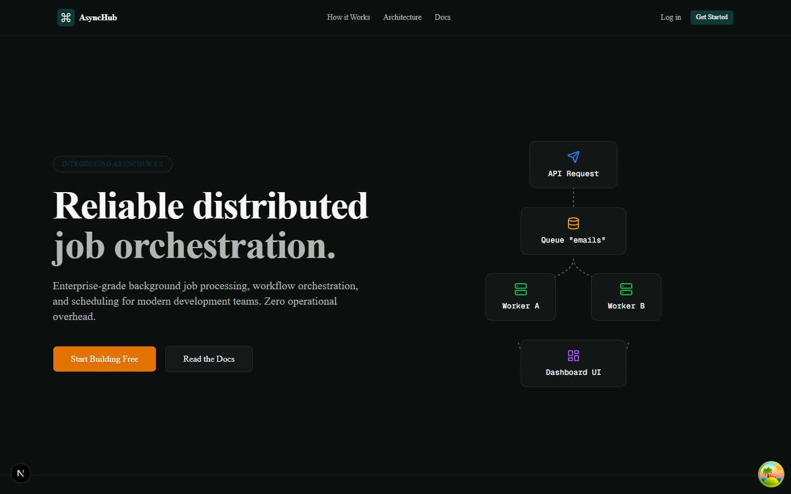
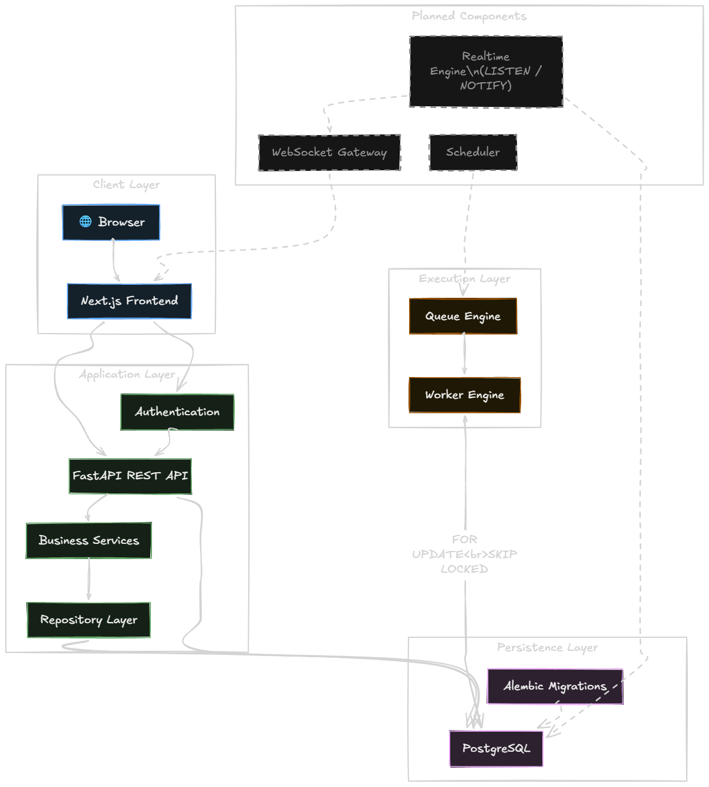
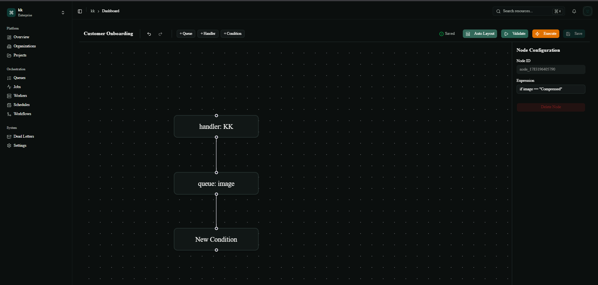
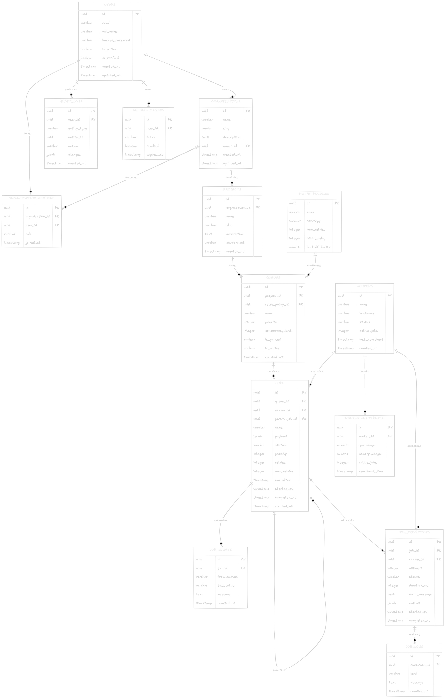

<div align="center">
  <h1>AsyncHub</h1>
  <p><strong>A Distributed Job Scheduling, Queue Management, and Workflow Orchestration Platforms</strong></p>
  
  
  
  [](https://fastapi.tiangolo.com/)
  [](https://nextjs.org/)
  [](https://www.postgresql.org/)
  [](https://www.docker.com/)
</div>

---

## 📖 Project Overview
AsyncHub is an open-source, full-stack distributed systems platform designed to orchestrate complex background jobs, execute DAG-based workflows, and provide complete operational visibility through a modern, real-time dashboard.

Built for resiliency and scale, it utilizes PostgreSQL `SKIP LOCKED` concurrency control to enable a distributed worker fleet without requiring an external message broker like RabbitMQ or Redis, keeping the architecture highly cohesive and easy to deploy.

### 🏛️ Architecture


## 🚀 The Problem & Solution
**The Problem**: Traditional background job systems often obscure failure. When a job drops, tracking the dead-letter queues, analyzing throughput, or orchestrating dependent jobs (DAGs) requires cobbling together multiple tools (like Celery + Flower + Airflow). 

**The Solution**: AsyncHub provides an out-of-the-box control plane. It marries the simplicity of queue-based workers with the power of visual DAG workflow orchestration. It offers:
- **Instant Observability:** Real-time dashboards, metrics, and worker heartbeats.
- **Reliability:** Built-in retry policies, exponential backoffs, and Dead Letter Queues (DLQ).
- **Extensibility:** Multi-tenant (Organizations & Projects), enabling platform-as-a-service usage.

## ✨ Features
- **Distributed Worker Fleet**: Spin up `N` workers that safely concurrently poll for jobs.
- **DAG Workflow Engine**: Build and execute complex node-based workflows.
- **React Flow Editor**: A beautiful, interactive drag-and-drop workflow canvas.
- **Cron Scheduling**: Schedule recurring jobs with standard cron syntax.
- **Real-Time Observability**: Live metrics, queue depths, and worker statuses.
- **Multi-Tenancy**: Isolate environments using Organizations and Projects with unique API Keys.




## 🛠️ Tech Stack
- **Backend:** Python, FastAPI, SQLAlchemy, Pydantic, Loguru, Alembic, PostgreSQL (asyncpg).
- **Frontend:** TypeScript, Next.js 16 (Turbopack), TailwindCSS, Shadcn UI, Zustand, `@xyflow/react` (React Flow), GSAP (Animations).
- **Infrastructure:** Docker, Docker Compose, GitHub Actions.

## 📁 Folder Structure
```
AsyncHub/
├── apps/
│   ├── api/                 # FastAPI Backend
│   │   ├── app/             # Application code (models, routes, worker engine)
│   │   ├── alembic/         # Database migrations
│   │   └── scripts/         # Utility scripts (seed_demo.py)
│   └── web/                 # Next.js Frontend
│       ├── src/app/         # Next.js App Router (Dashboard, Auth, Marketing)
│       └── src/components/  # UI Components & React Flow Nodes
├── docs/                    # Architectural and deployment documentation
├── docker-compose.yml       # Production/Local orchestrator
└── Makefile                 # Convenient command runner
```

## ⚙️ Guide: Local Setup

### Prerequisites
- Docker & Docker Compose
- Node.js 18+ (for local frontend dev)
- Python 3.11+ (for local backend dev)

### The "One-Click" Demo (Recommended for Reviewers)
Want to see the system alive immediately with realistic data?
```bash
make demo
```
*This command boots the entire stack via Docker and runs a Python seeder that creates organizations, projects, queues, workers, workflows, and 250+ jobs.*
**Visit: https://async-hub.vercel.app/** (Login with `demo@asynchub.com` / `demo123`)

### Standard Docker Setup
```bash
make up
```
*Starts API (8000), Web (3000), Postgres (5432), and 2 Background Workers.*

## 🗄️ Database
AsyncHub uses **PostgreSQL**.
- **Concurrency**: `SELECT ... FOR UPDATE SKIP LOCKED` ensures multiple distributed workers can claim jobs without deadlocks or race conditions.
- **Real-time**: Postgres `LISTEN/NOTIFY` channels broadcast job completion events back to the FastAPI websocket manager, updating the Next.js UI in real-time.
- **Schema**: See [Database.md](/docs/Database.md) for the full ER Diagram.

## 🎼 Orchestrator Guide (Workflows)
The Workflow Engine evaluates directed acyclic graphs (DAGs) stored in Postgres as `JSONB`.
1. A user builds a DAG in the Next.js React Flow editor.
2. The definition is stored with a `definition_version`.
3. When triggered, the backend calculates the "root" nodes (in-degree = 0) and enqueues them.
4. As workers complete jobs, the engine resolves dependencies and enqueues subsequent nodes.
- See [WorkflowEngine.md](/docs/WorkflowEngine.md) for deep dive.

## 🧪 Testing & CI/CD
Every pull request is evaluated by GitHub Actions:
- **Linting & Formatting:** Ensures consistent code style.
- **Type Checking:** Strict TypeScript & Mypy verification.
- **Alembic Validation:** Verifies database migrations.
- **Docker Compose Validation:** Ensures the environment boots successfully.

---
<div align="center">
  <p>Built with ❤️ for modern background task orchestration.</p>
</div>
