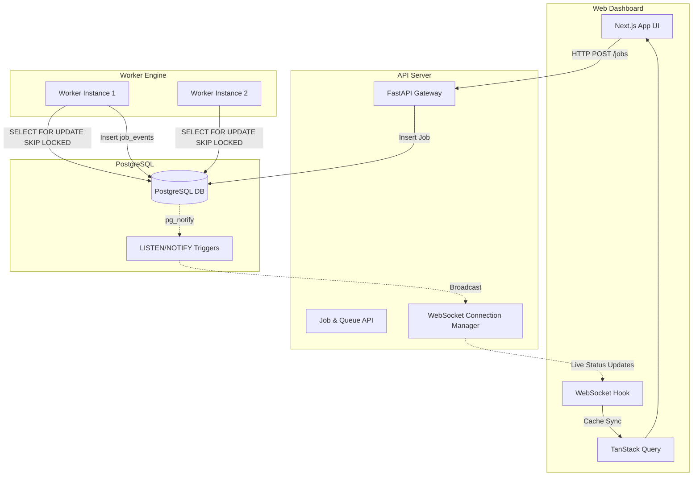

# AsyncHub

**Enterprise Distributed Job Orchestration Platform**
*Reliable • Observable • High-Performance*

AsyncHub is a modern, distributed background job orchestration platform designed to decouple the ingestion, orchestration, and execution of background workloads. 

Built with a service-oriented architecture, AsyncHub provides a robust job queue, distributed workers, and real-time observability, empowering organizations to manage thousands of jobs with confidence.

---

## 🏗️ Architecture

AsyncHub utilizes a smart, simplified architecture that eliminates the need for an external message broker (like Redis or RabbitMQ) for the core queuing engine. Instead, it leverages PostgreSQL's powerful transactional guarantees.



### Key Architectural Decisions:
1. **PostgreSQL as the Queue:** We use `SELECT ... FOR UPDATE SKIP LOCKED`. This provides a highly concurrent, reliable queue within the database itself, avoiding dual-write issues between a DB and Redis.
2. **PostgreSQL `LISTEN/NOTIFY`:** For real-time updates, database triggers emit lightweight notifications that our FastAPI connection manager broadcasts to the frontend.
3. **Real-time Cache Synchronization:** Instead of generic polling, the frontend subscribes to WebSocket updates and patches the TanStack Query cache dynamically (`queryClient.setQueryData`).

---

## ✨ Features Implemented

* **Multi-tenant Organization Model:** Full data modeling for Organizations, Projects, and Queues with JWT + Argon2 authentication.
* **Distributed Worker Engine:** Autonomous python runners that poll for jobs, execute them, and safely handle retries using exponential backoff without duplicating tasks.
* **Real-time WebSocket Layer:** Instant, zero-latency job state transitions (Queued ➔ Running ➔ Completed/Failed) streamed directly to the dashboard.
* **Optimistic UI:** Dashboard controls (like pausing/resuming queues) respond instantly with proper error rollbacks.
* **Enterprise UI:** A stunning Next.js 15 frontend featuring Tailwind CSS, `shadcn/ui`, `lucide-react`, and refined GSAP animations.
* **Docker Ready:** Effortless local development experience with fully configured Docker Compose files.

---

## 🚀 Getting Started (Local Development)

### Prerequisites
- Docker and Docker Compose
- Node.js 20+ and pnpm

### 1. Start the Backend Stack
We provide a `docker-compose.yml` that stands up the PostgreSQL database, the FastAPI API server, and 2 replicas of the Python Worker engine.

```bash
# Start Postgres, API, and 2 Workers
docker-compose up -d --build
```
*The API will be available at `http://localhost:8000`.*

### 2. Start the Frontend
The Next.js dashboard lives in the `apps/web` directory.

```bash
cd apps/web
pnpm install

# Start the dev server
pnpm dev
```
*The dashboard will be available at `http://localhost:3000`.*

---

## 📁 Repository Structure

```text
.
├── apps/
│   ├── api/                  # FastAPI Backend (Python)
│   │   ├── app/              # Core API logic, Models, Routes
│   │   ├── app/workers/      # Autonomous Worker execution loop
│   │   ├── alembic/          # DB Migrations (including Trigger setup)
│   │   └── Dockerfile
│   └── web/                  # Next.js Dashboard (TypeScript)
│       ├── src/app/          # App Router pages (Dashboard, Jobs, Queues)
│       ├── src/components/   # UI Library (shadcn/ui)
│       ├── src/hooks/        # Custom hooks (useQueueSocket)
│       └── src/lib/          # API Client and Utils
├── docker-compose.yml        # Local deployment orchestration
└── .github/workflows/        # CI/CD (Pytest Actions)
```

---

## 🗺️ Roadmap & Phases Completed

- ✅ **Phase 1: Database Schema** - Configured Postgres schema with full relations (Users, Orgs, Projects, Queues, Jobs, Job Events).
- ✅ **Phase 2: Backend Skeleton** - Built FastAPI structure, Pydantic schemas, and JWT/Argon2 Authentication.
- ✅ **Phase 3: Queue & Job CRUD** - Centralized business logic and API endpoints for managing the job lifecycle.
- ✅ **Phase 4: The Worker Engine** - Created the robust `SKIP LOCKED` polling mechanism, simulating real async executions with safe retries.
- ✅ **Phase 5: Realtime Layer** - Implemented Postgres `LISTEN/NOTIFY` triggers and the `ConnectionManager` for WebSockets.
- ✅ **Phase 6: Frontend Wiring** - Connected the Next.js shell to real data via `TanStack Query` and implemented live Cache Synchronization.
- ✅ **Phase 7: Deployment Configuration** - Packaged everything with Docker, configured healthchecks, environment variables, and GitHub Actions.

---

*Built with precision. Stop managing infrastructure and start building features.*