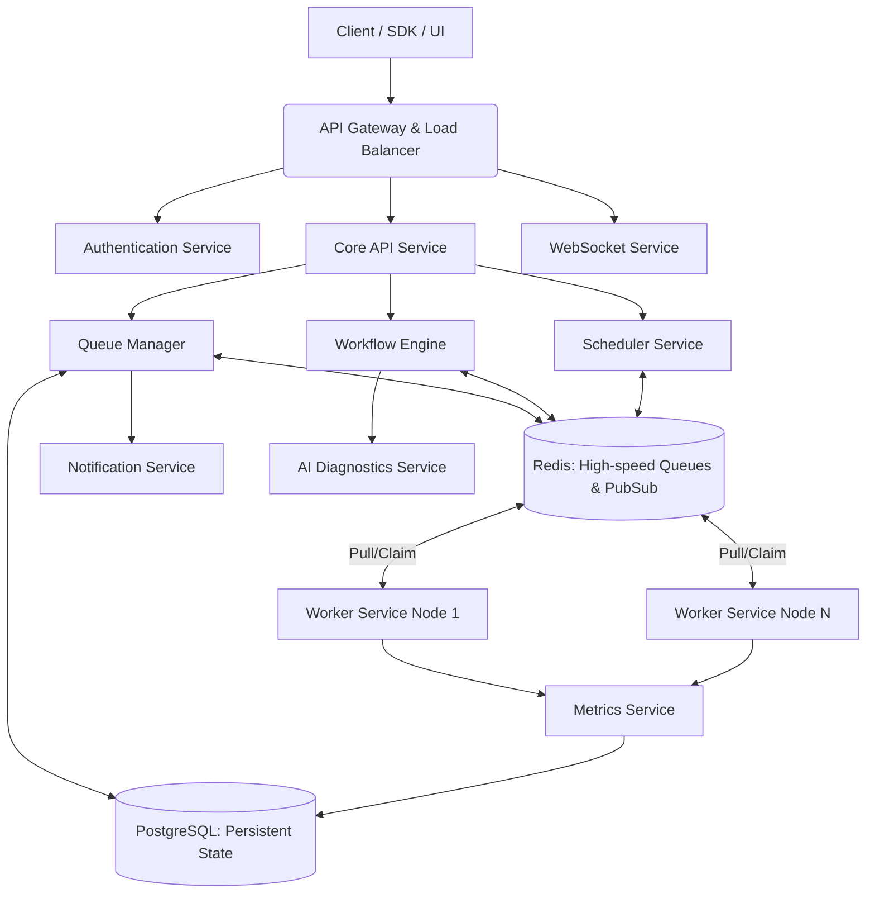

# AsyncHub Architecture Blueprint

**AsyncHub** is an enterprise-grade distributed background job orchestration platform. This document serves as the primary engineering blueprint for the platform's complete lifecycle, system architecture, and module definitions.

---

## 1. High Level Architecture

AsyncHub operates on a robust, distributed service-oriented architecture designed to decouple the ingestion, orchestration, and execution of workloads.



### Components
- **Frontend**: The control plane (Next.js) for operators and developers to manage and observe the system.
- **API (Core API Service)**: The central ingestion point for all REST/GraphQL traffic, handling authorization, rate limiting, and request validation.
- **Queue Manager**: Manages the lifecycle of queues and jobs. Interfaces directly with Redis for high-throughput state transitions and PG for historical persistence.
- **Scheduler**: Continuously evaluates cron expressions and delayed job conditions, moving jobs into active queues when ready.
- **Worker Service**: The distributed execution nodes. They poll or listen to Redis for available jobs, execute the payload, and report back status.
- **Workflow Engine**: Manages Directed Acyclic Graphs (DAGs) of jobs. When a job completes, the engine evaluates downstream dependencies.
- **Metrics Service**: Aggregates throughput, latency, and success rates, persisting them for the frontend dashboard.
- **WebSocket Service**: Subscribes to Redis Pub/Sub channels to broadcast real-time state changes to connected UI clients.
- **Notification Service**: Triggers webhooks, emails, or Slack alerts based on configured rules (e.g., job failures).
- **AI Diagnostics Service**: Asynchronously analyzes stack traces and failure patterns, appending root-cause hypotheses to failed jobs.
- **PostgreSQL**: The source of truth for persistent configuration (Orgs, Projects, Users), audit logs, and historical job data.
- **Redis**: The operational memory. Handles fast job pushing/popping, pub/sub for real-time updates, and worker heartbeats.

---

## 2. Module Breakdown

### Core Modules
- **Authentication**: Validates identities, issues JWTs, manages sessions. Depends on PostgreSQL. Critical for security.
- **Organizations & Projects**: Multi-tenancy isolation. Organizations contain billing and members; Projects contain queues and environments.
- **Queues**: Logical groupings of jobs. Responsible for concurrency limits, priority, and rate limiting.
- **Jobs**: The atomic unit of work. Contains payload, state, retries, and execution history.
- **Workers**: Represents the physical/logical nodes processing jobs. Responsible for tracking health, active claims, and resource utilization.
- **Schedules**: Manages cron-based or delayed recurring triggers.
- **Workflow**: Manages DAG dependencies. Responsible for parallel dispatching and conditional execution.
- **Analytics**: Aggregates time-series data for dashboard visualization (throughput, failure rates).
- **Audit Logs**: Immutable record of all state changes made by users or API keys for compliance (SOC2).
- **Notifications**: Rule-based alerting system.
- **Settings**: Configuration for rate limits, data retention policies, and API keys.
- **AI Diagnostics**: LLM-based analysis of error outputs.

---

## 3. User Journey

**Standard Operational Journey:**
1. **User Login**: Authenticates via OAuth/Email. JWT issued.
2. **Organization & Project Selection**: Context is set.
3. **Queue Configuration**: User creates a new queue (e.g., `image-processing`), setting concurrency limits.
4. **Job Ingestion (API)**: A client application pushes a job payload to the queue via API.
5. **Worker Execution**: A registered Worker Service node claims the job from Redis.
6. **Metrics Update**: Worker reports `RUNNING`, then `COMPLETED`. Metrics Service increments success counters.
7. **Real-time Dashboard**: WebSocket broadcasts the state change. The UI updates the job card to green instantly.
8. **Audit Log**: The system logs the job completion details for historical compliance.
9. **Notification (Optional)**: If the job failed, the Notification module would trigger a webhook to PagerDuty.

---

## 4. Job Lifecycle

**States:** `QUEUED` ➔ `SCHEDULED` ➔ `CLAIMED` ➔ `RUNNING` ➔ `COMPLETED` | `FAILED` ➔ `RETRYING` | `DLQ` ➔ `CANCELLED`

- **Queued**: Job is pushed by API. UI shows pending. Redis holds the ID.
- **Scheduled**: Job has a future execution time. Scheduler evaluates it.
- **Claimed**: Worker pops job from Redis queue. Atomically locks it. UI updates to 'Claimed'.
- **Running**: Worker starts processing. Sends heartbeat. UI shows active timer.
- **Completed**: Worker finishes successfully. DB updated with result payload. Removed from active Redis queue.
- **Failed**: Exception caught. DB records stack trace.
- **Retrying**: Queue Manager evaluates retry policy. If attempts remain, moves back to `QUEUED` with backoff.
- **Dead Letter Queue (DLQ)**: Max retries exceeded. Job requires manual intervention.
- **Cancelled/Paused**: Operator manually intervenes via UI/API.

---

## 5. Queue Lifecycle

- **Active**: Normal operation. Accepting and dispatching jobs.
- **Paused**: Accepts jobs (enqueues) but does *not* dispatch to workers. Used during downstream outages.
- **Draining**: Dispatches existing jobs to workers, but rejects *new* incoming jobs. Used for deprecation.
- **Archived**: Read-only historical state. No jobs accepted or dispatched.
- **Deleted**: Soft-deleted in DB.

---

## 6. Worker Lifecycle

1. **Registration**: Worker boots up, authenticates with API, and registers capabilities (e.g., handles `image-processing`).
2. **Heartbeat**: Worker pings Redis every 5 seconds. If missed (e.g., OOM kill), API marks worker as `DEAD`.
3. **Polling/Listening**: Worker uses `BRPOPLPUSH` (or Redis Streams) for low-latency job claiming.
4. **Claim Job**: Atomically moves job to an internal processing list.
5. **Execute**: Runs user code/binary with payload.
6. **Retry/Fail**: Reports exact error back to API.
7. **Shutdown**: Graceful `SIGTERM` handler. Finishes active jobs, refuses new claims, deregisters.
8. **Recovery**: If worker dies, API sweeps orphaned "Claimed" jobs after timeout and requeues them.

---

## 7. Scheduling Engine

- **Immediate Jobs**: Pushed directly to Redis `LIST` or `STREAM`.
- **Delayed Jobs**: Stored in a Redis `ZSET` (Sorted Set) scored by target timestamp. A polling mechanism (Scheduler) checks `ZSET` and moves ready jobs to the active queue.
- **Scheduled/Recurring**: Stored in PostgreSQL. Evaluated by a central cron-evaluator.
- **Batch Jobs**: Large arrays of jobs ingested simultaneously. Split into chunks by API to prevent memory spikes.

---

## 8. Workflow Engine (DAGs)

- **Dependencies**: Jobs are vertices; dependencies are edges.
- **Conditional Execution**: A parent job returns a payload. The engine evaluates JSON paths to decide which child branch to queue.
- **Parallel Execution**: Parent completes; engine pushes multiple child jobs to queues simultaneously.
- **Failure Handling**: If a critical node fails, downstream nodes are marked `CANCELLED_CASCADE`.

---

## 9. Real-Time Architecture

- **Mechanism**: WebSockets powered by Socket.io / native WebSockets on the API layer.
- **Broadcasting Strategy**:
  1. Worker updates job state in Redis.
  2. Redis triggers a Pub/Sub event: `PUBLISH org_id:project_id:events { "type": "JOB_COMPLETED", "jobId": "123" }`.
  3. WebSocket Service listens to Redis Pub/Sub, maps `org_id` to connected clients, and broadcasts the event.
  4. Frontend (Zustand/React Query) merges the delta optimistically.

---

## 10. Folder Structure

```text
asynchub/
├── apps/
│   ├── web/               # Next.js 15 Frontend (Dashboard & Landing)
│   ├── api/               # Core API, WebSockets, Queue Management (Node/Go/Rust)
│   └── worker/            # Default Node.js worker implementation & CLI
├── packages/
│   ├── database/          # Prisma/Drizzle schema, migrations, DB clients
│   ├── shared/            # Common TS types, validation schemas (Zod), constants
│   ├── types/             # Domain entities, interfaces
│   └── ui/                # Shared React components (Shadcn), design tokens
```
- **Monorepo Strategy**: Using Turborepo or PNPM workspaces ensures shared types (`packages/types`) are perfectly synced between `apps/web` and `apps/api`.

---

## 11. Clean Architecture

- **Presentation Layer** (`apps/web`, `apps/api/controllers`): Handles HTTP/WS requests, auth extraction, payload validation.
- **Application Layer** (`apps/api/services`): Use cases (e.g., `EnqueueJobUseCase`). Orchestrates domain entities and infra.
- **Domain Layer** (`packages/types`, `packages/shared`): Core business logic, state machines (e.g., "A job cannot go from COMPLETED to RUNNING").
- **Infrastructure Layer** (`packages/database`, Redis clients): Concrete implementations of repositories (DB access, Queue access).
- **Dependency Flow**: Presentation ➔ Application ➔ Domain. Infrastructure implements Domain interfaces.

---

## 12. Scalability

- **Horizontal Scaling**: `apps/api` and `apps/worker` are completely stateless. Scale via Kubernetes HPA.
- **High Availability**: Redis configured in Cluster mode or Sentinel. PostgreSQL with Read Replicas.
- **100 Workers / 1 Million Jobs**:
  - Redis easily handles >100k ops/sec.
  - Job payloads are stored in PostgreSQL/S3 if large; Redis only holds IDs and minimal state to preserve RAM.
  - Metrics are batched in memory and bulk-inserted to PG to prevent write-locks.

---

## 13. Security

- **Authentication**: JWT access tokens (short-lived, 15m) + HttpOnly refresh tokens (long-lived, 7d).
- **RBAC**: Roles (Owner, Admin, Viewer) enforced at the Application layer.
- **API Keys**: Deterministic hashing (SHA-256) for programmatic access from client systems.
- **Rate Limiting**: Redis-based sliding window algorithm per Org/Project to prevent noisy neighbors.
- **Audit Logging**: Every mutating API request is intercepted by middleware and appended to an append-only PG table.

---

## 14. Development Roadmap

- **Milestone 1: Foundation (Completed)** - Frontend shell, design system, monorepo setup.
- **Milestone 2: Data Layer & Core API** - PG schema design, Redis connection, Basic CRUD for Orgs/Projects/Queues.
- **Milestone 3: Execution Engine** - Worker registration, job ingestion, basic popping, heartbeat mechanism.
- **Milestone 4: Real-Time & Observability** - WebSockets, Metrics aggregation, basic dashboard charts.
- **Milestone 5: Advanced Orchestration** - DAGs, Cron scheduling, DLQ management.
- **Milestone 6: Enterprise Readiness** - RBAC, Audit Logs, API Key management, AI Diagnostics.

---

## 15. Core Domain & Policy Decisions (ADR)

This section acts as the single source of truth for domain decisions to prevent architectural drift.

### 15.1 RBAC Rules (Organization Roles)
The `OrganizationMember.role` determines permissions:
- **Viewer**: Read-only access to organizations, projects, queues, and jobs.
- **Developer**: Can create projects and queues, and enqueue jobs. Cannot manage queue lifecycle (pause/resume).
- **Admin**: Full control over queues (pause/resume/delete) and members, minus billing/ownership.
- **Owner**: Full control.

### 15.2 Job Lifecycle & Tracking
We separate auditing from execution metrics to ensure lightweight status tracking and heavy execution logging do not collide.
- **JobEvent**: A lightweight audit trail of state transitions (e.g., `queued` ➔ `claimed` ➔ `running` ➔ `completed`). Represents "What happened to this job?"
- **JobExecution**: A heavy record of an actual execution attempt. Includes `worker_id`, `started_at`, `completed_at`, `duration_ms`, `error`, `logs`, and `output`. Represents "How did this execution perform?"

### 15.3 Atomicity Guarantees
- The `enqueue_job()` service method MUST be fully transactional. The creation of a `Job` row and its initial `JobEvent` (status: `queued`) must occur within a single database transaction. A failure in either must rollback both.

### 15.4 Idempotency
- The `Job` model includes an `idempotency_key` field. This ensures that clients retrying timeout requests will not accidentally enqueue duplicate jobs.

---
*End of Blueprint*
