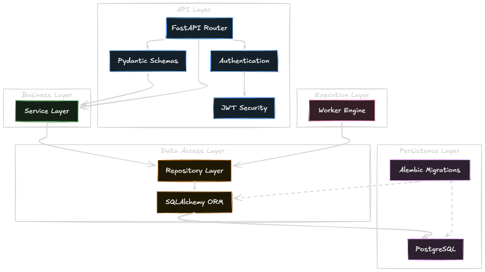

# System Architecture

## 1. Overall Architecture


*Figure 1. High-level AsyncHub System Architecture*

AsyncHub is designed as a distributed background job scheduling and execution platform. The architecture follows a multi-tier client-server model, optimized for a multi-tenant environment. The primary components are:
- **Frontend (Web App):** A Next.js application providing the user interface for managing organizations, projects, queues, jobs, and monitoring workers.
- **Backend (API Server):** A FastAPI Python application serving as the control plane. It handles authentication, API requests, data persistence, and job enqueuing.
- **Worker Engine:** A fleet of Python-based worker nodes that poll the database for jobs, execute them, and report results back.
- **Database:** A PostgreSQL database that acts as both the primary data store and the message broker (utilizing `SKIP LOCKED` for queue concurrency).

## 2. High-Level Component Diagram

```mermaid
flowchart TD
    Client[Web Browser (Next.js)] -->|REST API (HTTPS)| API[FastAPI API Server]
    API <-->|SQLAlchemy (asyncpg)| DB[(PostgreSQL)]
    Worker1[Python Worker 1] <-->|Poll (SKIP LOCKED)| DB
    Worker2[Python Worker N] <-->|Poll (SKIP LOCKED)| DB
    
    subgraph Control Plane
        API
    end
    
    subgraph Execution Plane
        Worker1
        Worker2
    end
```

## 3. Folder Structure (Monorepo Layout)
AsyncHub uses a monorepo structure to keep the API and Web client synchronized:
```
AsyncHub/
├── apps/
│   ├── api/                 # Backend API (FastAPI)
│   │   ├── app/             # Application code
│   │   │   ├── api/         # REST Routers
│   │   │   ├── core/        # Configuration & Security
│   │   │   ├── db/          # Database connection
│   │   │   ├── models/      # SQLAlchemy ORM Models
│   │   │   ├── repositories/# Data Access Layer
│   │   │   ├── schemas/     # Pydantic validation schemas
│   │   │   ├── services/    # Business Logic Layer
│   │   │   └── workers/     # Worker Engine logic
│   │   ├── scripts/         # Utility scripts (e.g., DB seeding)
│   │   └── alembic/         # Database migrations
│   └── web/                 # Frontend Web App (Next.js)
│       ├── src/
│       │   ├── app/         # Next.js App Router (pages)
│       │   ├── components/  # Reusable UI components
│       │   ├── lib/         # Utilities (API client)
│       │   ├── providers/   # React Context providers
│       │   └── animations/  # GSAP animation hooks
└── docs/                    # Architecture documentation
```

## 4. Backend Architecture


*Figure 2. Backend Layered Architecture*

The backend is built with **FastAPI**. It enforces a strict layered architecture:
- **Routers (`/api`):** Handle HTTP request/response formatting.
- **Services (`/services`):** Contain core business logic.
- **Repositories (`/repositories`):** Isolate all SQLAlchemy database queries.
- **Models (`/models`):** Define the database schema using SQLAlchemy ORM.
- **Schemas (`/schemas`):** Validate input/output using Pydantic.

## 5. Frontend Architecture
The frontend is built with **Next.js (App Router)** and **React**.
- **State Management:** Uses **React Query (@tanstack/react-query)** for server-state caching and synchronization, and React Context (`WorkspaceProvider`) for global client state (e.g., active organization).
- **Styling:** Tailwind CSS combined with Radix UI primitives (via `shadcn/ui`) for accessible, consistent components.
- **Animations:** GSAP (GreenSock) is used for complex landing page and scroll-reveal animations.

## 6. Worker Architecture
The Worker Engine is currently implemented as a Python script (`app.workers.runner`). 
- **Polling:** Workers poll the database at regular intervals.
- **Concurrency:** Multiple workers can safely poll the same queue using PostgreSQL's `FOR UPDATE SKIP LOCKED` mechanism, ensuring a job is only claimed by a single worker.
- **Status Reporting:** Workers transition jobs through `queued` -> `running` -> `completed` / `failed` / `dead` and log `JobEvent` records for history.

## 7. Scheduler Architecture (Planned)
Currently, jobs are executed as soon as they are claimed. Future updates will introduce a Scheduler component responsible for:
- Evaluating `run_after` timestamps for delayed jobs.
- Managing recurring (cron-based) jobs.

## 8. Realtime Architecture (Planned)
The current UI requires manual refreshing or React Query polling to see job updates.
- **Future Implementation:** PostgreSQL `LISTEN / NOTIFY` combined with WebSockets in FastAPI to push live job status changes to the frontend instantly.

## 9. Database Technologies
- **PostgreSQL:** The sole database, hosted via Supabase. Chosen for its robust ACID compliance, JSONB support for flexible job payloads, and concurrency features (`SKIP LOCKED`).
- **Alembic:** Used for schema migrations.

## 10. External Dependencies
- **Supabase (PostgreSQL hosting)**
- **Tailwind CSS / Radix UI / Lucide Icons**
- **TanStack React Query**
- **GSAP (GreenSock Animation Platform)**
- **SQLAlchemy (asyncpg)**
- **PyJWT / Passlib (Authentication)**
