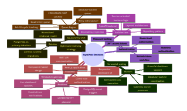

# Architecture Decisions

## Design Decisions

*Figure 3. High-level Architecture Decision Map*

This document serves as the Architecture Decision Record (ADR) for AsyncHub. It captures the context, alternatives, and reasoning behind major architectural choices made during the platform's development.

---

### ADR 1: Three-Tier Architecture (Repository & Service Layers)
- **Problem:** Tying SQLAlchemy queries directly to FastAPI route handlers creates tightly coupled code that is difficult to test, reuse, or migrate to different database technologies.
- **Alternatives Considered:** 
  - Active Record pattern (direct ORM usage in routes).
  - Fat Models (putting business logic inside SQLAlchemy models).
- **Decision Made:** We implemented a strict 3-tier architecture: Routers (HTTP), Services (Business Logic), and Repositories (Data Access).
- **Trade-offs:** Introduces boilerplate code and requires mapping between layers, slightly slowing down initial development speed.
- **Future Considerations:** Allows us to easily swap PostgreSQL for another database for specific domains, or extract services into microservices without rewriting business logic.

---

### ADR 2: PostgreSQL as a Message Broker (`SKIP LOCKED`)
- **Problem:** A distributed background job scheduler typically requires a dedicated message broker to manage queues and prevent multiple workers from claiming the same job.
- **Alternatives Considered:** 
  - Redis + Celery/RQ (Industry standard, requires additional infrastructure).
  - RabbitMQ / Kafka (High complexity, operationally heavy).
- **Decision Made:** We chose to use PostgreSQL itself as the broker, leveraging the `FOR UPDATE SKIP LOCKED` feature for queue polling.
- **Trade-offs:** High-throughput polling can put heavy load on the Postgres CPU compared to Redis. Write-heavy workloads might face lock contention at extreme scale. However, it dramatically reduces infrastructure complexity for the MVP.
- **Future Considerations:** If throughput exceeds Postgres capabilities, we can introduce Redis for high-frequency queues while keeping Postgres for durable storage.

---

### ADR 3: Stateless JWT Authentication
- **Problem:** How to authenticate users securely across a distributed API and frontend without sticky sessions or centralized session stores.
- **Alternatives Considered:** 
  - Stateful session cookies (Requires a session store like Redis).
  - Long-lived JWTs (Security risk if leaked).
- **Decision Made:** Short-lived JWT Access Tokens (15 minutes) paired with longer-lived Refresh Tokens (7 days).
- **Trade-offs:** Requires the frontend to handle 401 Unauthorized errors and seamlessly request new tokens in the background, adding complexity to the client.
- **Future Considerations:** We can implement Token Revocation lists (blacklists) in Redis if immediate invalidation becomes a strict security requirement.

---

### ADR 4: Multi-Tenant Organization Structure
- **Problem:** SaaS applications require users to collaborate in isolated workspaces. Retrofitting multi-tenancy later requires massive, risky database migrations.
- **Alternatives Considered:** 
  - Single-tenant instances (Difficult to manage for SaaS).
  - Adding `user_id` to every row (Fails for team collaboration).
- **Decision Made:** Designed with an `organizations`, `projects`, `queues` hierarchy from day one. All resources are tied to an organization.
- **Trade-offs:** Adds complexity to every database query, as we must always filter by `org_id` and check Role-Based Access Control (RBAC) via `organization_members`.
- **Future Considerations:** Fine-grained permissions (e.g., read-only roles per project) can be easily layered on top of the existing `organization_members` structure.

---

### ADR 5: Job Model & Dead Letter Queue (DLQ)
- **Problem:** Failing jobs can poison the queue, crashing workers in an infinite retry loop.
- **Alternatives Considered:** 
  - Discarding failed jobs automatically.
  - Pausing the entire queue upon failure.
- **Decision Made:** A job has `retries` and `max_retries`. If a job exhausts all retries, its state transitions to `dead` instead of `queued` or `failed`. 
- **Trade-offs:** Dead jobs accumulate in the database, potentially consuming storage over time.
- **Future Considerations:** Implement automated archiving or purging of DLQ jobs after a retention period (e.g., 30 days).

---

### ADR 6: Job Events & Executions
- **Problem:** We need absolute observability into a job's lifecycle to debug distributed failures.
- **Alternatives Considered:** 
  - Storing a single "last_error" column on the job row.
  - Logging entirely to external systems (DataDog/CloudWatch) without DB context.
- **Decision Made:** Created two separate tables: `job_events` (status transitions for high-level audit logs) and `job_executions` (detailed attempt records including worker ID, duration, and error tracebacks).
- **Trade-offs:** High write volume to the database. Every job execution inserts multiple rows.
- **Future Considerations:** Partitioning these tables by date to ensure query performance as the dataset grows into the millions of rows.

---

### ADR 7: Realtime Updates (Planned)
- **Problem:** Polling the API for job statuses is inefficient for the frontend and scales poorly.
- **Alternatives Considered:** 
  - React Query Polling (Current MVP fallback).
  - Server-Sent Events (SSE).
- **Decision Made (Planned):** WebSockets powered by PostgreSQL `LISTEN / NOTIFY`.
- **Trade-offs:** Managing WebSocket connections in FastAPI requires careful resource management and keeping track of connected clients.
- **Future Considerations:** When a worker updates a job status, a Postgres trigger fires a NOTIFY payload. The FastAPI WebSocket server listens to this and pushes the update directly to the connected Next.js client.
