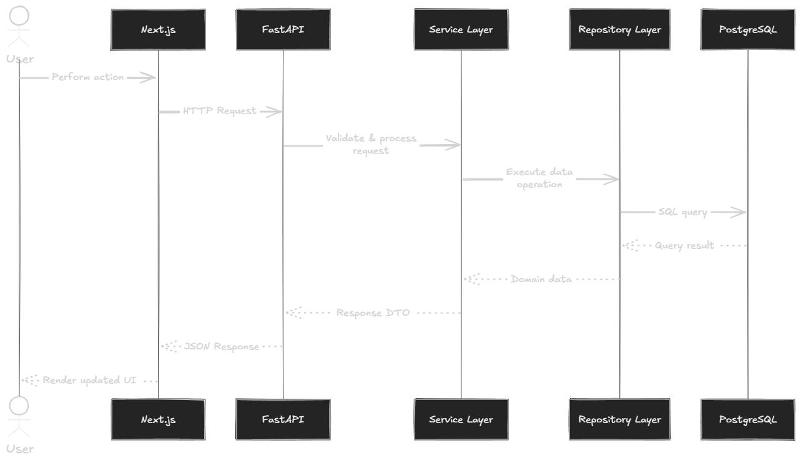
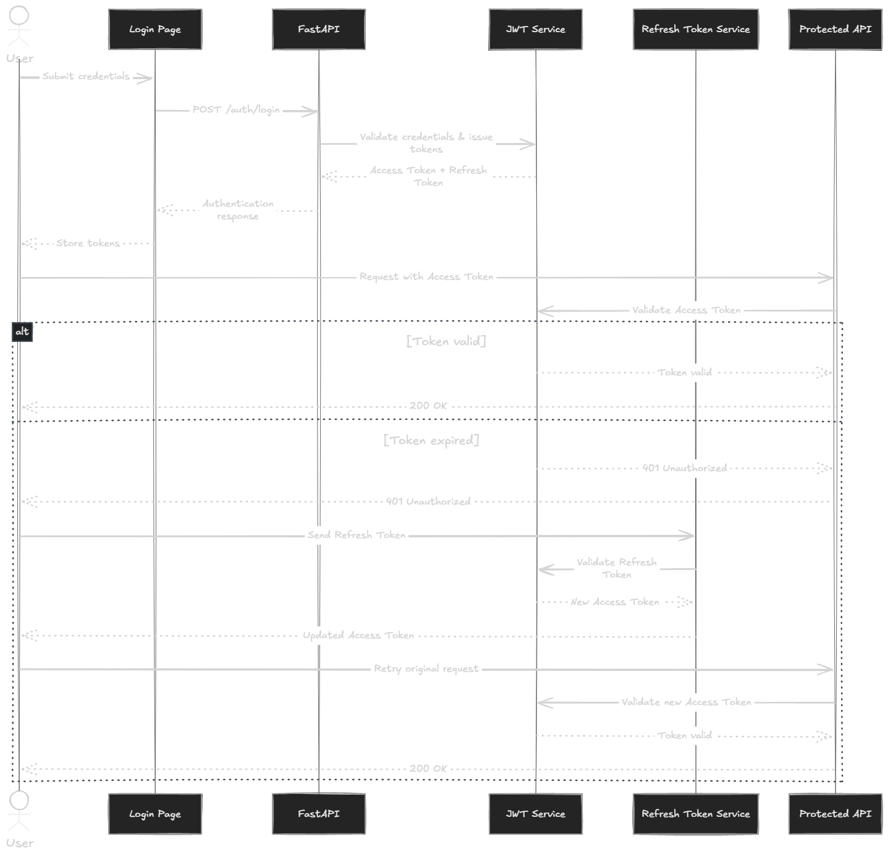

# API Design

*Figure 6. API Request Flow*

AsyncHub exposes a RESTful JSON API using FastAPI. All endpoints (except public auth endpoints) require a valid JWT Bearer token.

*Figure 5. Authentication Flow*

## Authentication Endpoints

### 1. `POST /api/v1/auth/signup`
- **Description:** Registers a new user.
- **Auth:** None
- **Request Body:** `{ "email": "user@ex.com", "password": "...", "full_name": "..." }`
- **Response Body:** `{ "id": "...", "email": "...", "is_active": true }`
- **Status Codes:** 201 Created, 400 Bad Request (Email exists)

### 2. `POST /api/v1/auth/login`
- **Description:** Authenticates a user and returns JWT tokens.
- **Auth:** None
- **Request Body:** OAuth2 Password Request Form (`username`, `password`)
- **Response Body:** `{ "access_token": "...", "refresh_token": "...", "token_type": "bearer" }`
- **Status Codes:** 200 OK, 401 Unauthorized

### 3. `POST /api/v1/auth/refresh`
- **Description:** Generates a new access token using a valid refresh token.
- **Auth:** None
- **Request Body:** `{ "refresh_token": "..." }`
- **Response Body:** `{ "access_token": "...", "refresh_token": "...", "token_type": "bearer" }`
- **Status Codes:** 200 OK, 401 Unauthorized (Invalid/Expired token)

### 4. `GET /api/v1/auth/me`
- **Description:** Retrieves the currently authenticated user's profile.
- **Auth:** Bearer Token
- **Response Body:** `{ "id": "...", "email": "...", "full_name": "..." }`
- **Status Codes:** 200 OK, 401 Unauthorized

## Organization Endpoints

### 5. `POST /api/v1/organizations/`
- **Description:** Creates a new organization and assigns the caller as "owner".
- **Auth:** Bearer Token
- **Request Body:** `{ "name": "...", "slug": "..." }`
- **Response Body:** `{ "id": "...", "name": "...", "slug": "..." }`
- **Status Codes:** 201 Created, 400 Bad Request (Slug exists)

### 6. `GET /api/v1/organizations/`
- **Description:** Lists all organizations the authenticated user is a member of.
- **Auth:** Bearer Token
- **Response Body:** `[ { "id": "...", "name": "...", "slug": "..." } ]`
- **Status Codes:** 200 OK

## Planned / Placeholder Endpoints

These endpoints represent the intended API surface for full MVP completion but are currently placeholders or under construction:

### Projects API
- `POST /api/v1/projects/` - Create a project within an organization.
- `GET /api/v1/projects/?org_id=...` - List projects.

### Queues API
- `POST /api/v1/queues/` - Create a queue within a project.
- `GET /api/v1/queues/?project_id=...` - List queues.

### Jobs API
- `POST /api/v1/jobs/` - Enqueue a new job payload.
- `GET /api/v1/jobs/?queue_id=...` - List jobs (with pagination/filtering).
- `GET /api/v1/jobs/{job_id}` - Get full job details, events, and executions.
- `POST /api/v1/jobs/{job_id}/cancel` - Cancel a pending/running job.
- `POST /api/v1/jobs/{job_id}/retry` - Retry a failed/dead job.

### Workers API
- `GET /api/v1/workers/?org_id=...` - List currently active workers (heartbeats).

## Error Handling Conventions
All API errors return standard HTTP status codes with a JSON body detailing the error:
`{ "detail": "Human readable error message" }`
Validation errors (e.g., missing fields) automatically return `422 Unprocessable Entity` courtesy of FastAPI and Pydantic.
