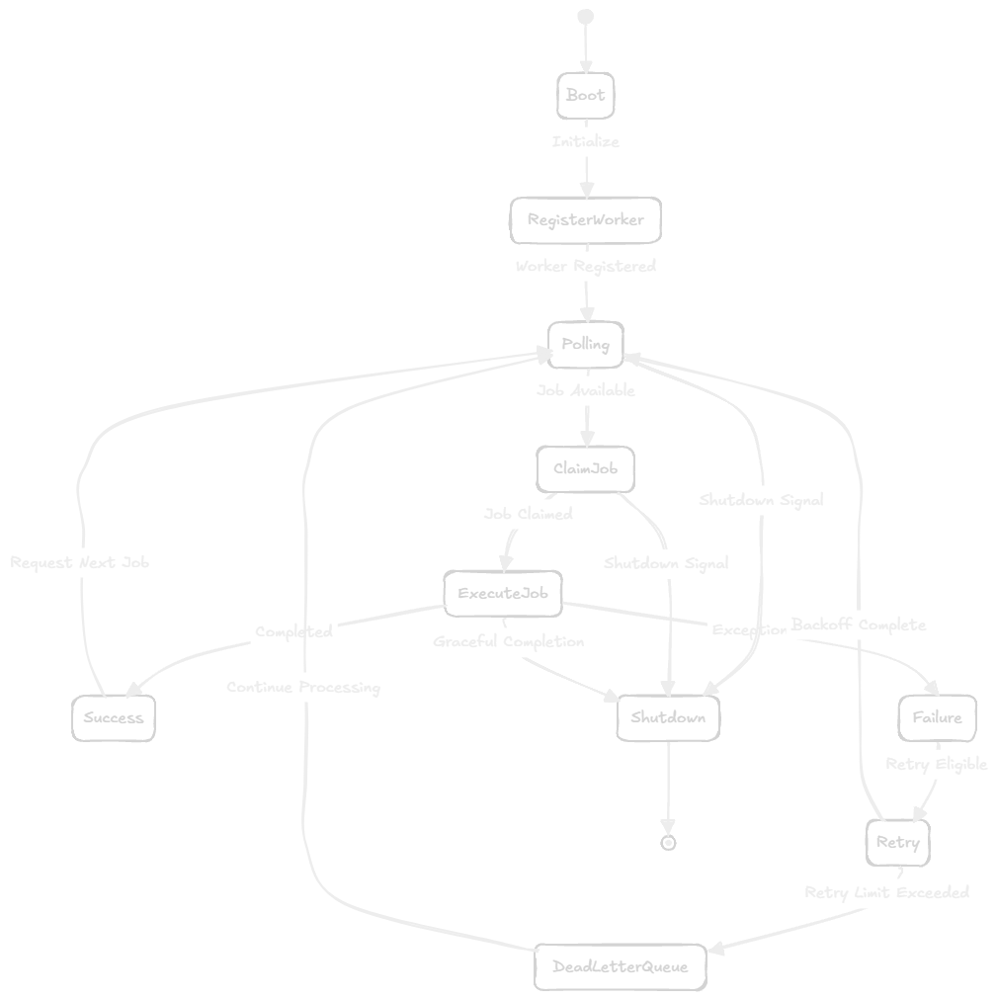

# Worker Engine

The Worker Engine is the distributed execution heart of AsyncHub. Currently implemented as a standalone Python process (`app.workers.runner`), workers poll the database to discover, claim, and execute pending jobs.

## Lifecycle


*Figure 7. Worker Lifecycle*

1. **Bootstrapping:** The worker process boots up, connects to the database via SQLAlchemy, and registers itself (in-memory or planned heartbeat system).
2. **Polling:** The worker enters a continuous asynchronous loop, querying the database for jobs with `status = 'queued'`.
3. **Claiming (Atomic):** Using PostgreSQL's `FOR UPDATE SKIP LOCKED`, the worker attempts to claim a job. This locks the specific row. If successful, the job's status is immediately updated to `running` to prevent other workers from taking it, and the lock is released. (Note: The query automatically handles delayed jobs by adding `run_after <= NOW() OR run_after IS NULL`).
4. **Execution:** The worker inspects the job's `payload`, performs the actual work (currently a simulated sleep/print in the MVP), and captures the outcome.
5. **Completion / Failure:** 
   - On success, the job status is set to `completed`.
   - On failure, the retry logic kicks in.

## Scheduler Engine

The `Scheduler Engine` is a separate daemon (`app.workers.scheduler`) responsible for evaluating recurring and cron jobs. 
- **Decoupled Architecture:** The Worker executes jobs; the Scheduler creates them. They do not communicate directly.
- **Transactional Dispatch:** When a schedule (`next_run_at <= NOW()`) is picked up, it is locked using `SKIP LOCKED`. A new job is inserted into the queue, the `cron_expression` is evaluated to determine the next trigger, and the schedule's `next_run_at` and `last_run_at` are updated—all within a single, atomic transaction. This guarantees no duplicate dispatches if the scheduler process crashes mid-evaluation.
- **Missed Executions:** If the scheduler is offline and misses multiple triggers, it explicitly calculates the *next* trigger from `NOW()` rather than attempting to rapidly replay all missed schedules.

## Retries and Failure Recovery
When a job throws an exception during execution:
- The worker increments the `retries` count.
- If `retries < max_retries`, the job status is reverted to `failed` and then immediately back to `queued` for a subsequent attempt (or delayed based on `retry_policy`).
- If `retries >= max_retries`, the job transitions to `dead`. It is placed in the Dead Letter Queue (DLQ) and requires manual intervention to replay.

## Concurrency Model & SKIP LOCKED
AsyncHub avoids complex locking algorithms by delegating concurrency control to PostgreSQL:
```sql
SELECT * FROM jobs 
WHERE status = 'queued' 
ORDER BY priority ASC, created_at ASC 
LIMIT 1 
FOR UPDATE SKIP LOCKED;
```
This statement ensures that if multiple workers poll simultaneously, they will securely claim different rows without waiting for locks to release, allowing horizontal scaling of the worker fleet out-of-the-box.

## Current Limitations & Future Roadmap
- **Heartbeats & Dead Worker Detection:** Currently, if a worker process crashes mid-execution (OOM or hard kill), the job remains stuck in the `running` state forever. We plan to implement a heartbeat system. If a worker hasn't pinged in X seconds, a cleanup daemon will revert its `running` jobs back to `queued`.
- **Concurrency Enforcement:** A single worker processes jobs sequentially in an async loop. We plan to introduce threaded/asyncio task pools to allow a single worker process to handle $N$ jobs concurrently based on the Queue's `concurrency_limit`.
- **Graceful Shutdown:** Implemented partially. Workers need to trap SIGTERM and allow currently running jobs to finish before exiting to prevent unexpected job failures during deployments.
