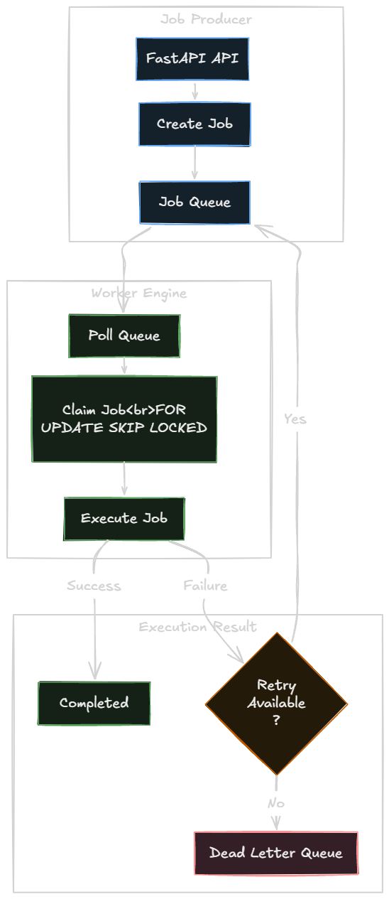
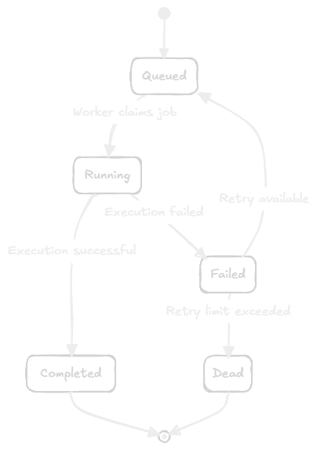

# Queue Engine

The Queue Engine is responsible for organizing, prioritizing, and managing the state of jobs within a specific boundary (a Project).

## Queue Processing

*Figure 8. Queue Processing Flow*

Queues are highly configurable entities within a project:
- **Priority:** Queues can be assigned a priority level (lower number = higher priority). Workers checking multiple queues will prioritize jobs from queues with a lower priority integer.
- **Concurrency Limit (`concurrency_limit`):** Defines the maximum number of jobs from this queue that can be processed simultaneously across the entire worker fleet. (Currently stored in DB, enforcement logic is planned).
- **Pause/Resume (`is_paused`):** A boolean flag that prevents workers from claiming jobs from the queue without deleting the underlying jobs.
- **Retry Policy (`retry_policy`):** A JSONB field that can dictate backoff algorithms (linear, exponential) for jobs within the queue. (Currently stored, backoff enforcement is planned).

## Job State Machine

*Figure 9. Job State Transition Diagram*

A job in a queue undergoes a strict state machine lifecycle:

1. **`queued`**: The initial state. The job is ready to be claimed by a worker.
2. **`running`**: A worker has successfully locked and claimed the job.
3. **`completed`**: The worker executed the job without exceptions.
4. **`failed`**: The worker encountered an exception. The job's `retries` count is incremented. If `retries < max_retries`, it immediately returns to `queued`.
5. **`dead`**: The job has exhausted its `max_retries`. It is moved to the Dead Letter Queue.

## Dead Letter Queue (DLQ)
Instead of discarding failing jobs or allowing them to crash workers in an infinite retry loop, AsyncHub moves them to a `dead` state. 
These jobs are surfaced in the DLQ UI, where engineers can inspect the `error` tracebacks in the `JobExecution` logs, fix the underlying code/data, and manually hit "Replay" (which resets `retries` to 0 and changes the status back to `queued`).

## Dispatch & Enqueueing
When jobs are created via the REST API (`POST /api/v1/queues/{queue_id}/jobs`), they are written directly to the PostgreSQL `jobs` table with `status = 'queued'`.

**Batch Submission:**
An optimized `POST /api/v1/queues/{queue_id}/jobs/batch` endpoint allows inserting arrays of jobs. The Queue Engine accepts these jobs and commits them in a single bulk transaction (`session.add_all`), maximizing throughput and minimizing database connection overhead.

**Delayed Jobs (`run_after`):**
Jobs can be created with a `run_after` timestamp. The queue engine natively ignores these jobs until the timestamp is met, effectively implementing delayed job queues without requiring a separate "waiting" store.
