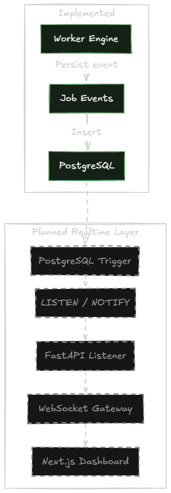

# Realtime Architecture

AsyncHub aims to provide live updates of job statuses to the frontend dashboard, eliminating the need for inefficient client-side polling.

## Architecture

*Figure 10. Realtime Event Pipeline*

The planned realtime architecture relies on PostgreSQL's native capabilities coupled with WebSockets.

### Event Propagation Flow
1. **State Change:** A worker updates a job's status in the database (e.g., from `queued` to `running`).
2. **PostgreSQL Trigger:** A database trigger intercepts the UPDATE statement and executes `pg_notify`.
3. **LISTEN Channel:** The FastAPI backend maintains an asynchronous connection listening to the PostgreSQL notification channel.
4. **WebSocket Broadcast:** Upon receiving the notification, the backend identifies the relevant organization/project and broadcasts the payload to all connected Next.js WebSocket clients.
5. **UI Update:** The React frontend receives the WebSocket message and optimistically updates the local React Query cache, causing the UI to instantly reflect the new job status.

### Current Implementation Status
Currently, the frontend relies on React Query's built-in background refetching (e.g., on window focus) to update the dashboard. The `LISTEN/NOTIFY` and WebSocket infrastructure is the highest priority for the next development phase to achieve true realtime observability.
